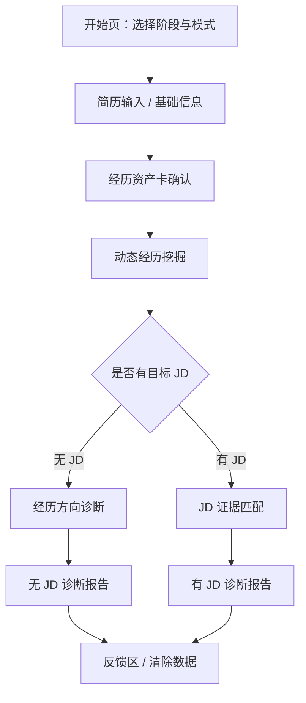

# V0.3 UX 用户流程

## 开始页

- 用户选择当前阶段：准应届生 / 应届生。
- 用户选择诊断模式：无 JD 经历盘点 / 有 JD 定制诊断。
- 显示隐私提示、真实性声明、真实 AI 状态。
- 用户心理：既期待被帮到，又担心自己经历太少。
- 流失点：文案太像营销、流程看起来太复杂、担心隐私。

## 简历输入 / 基础信息页

- 支持粘贴简历文本。
- 支持填写学历、学校、专业、毕业时间、城市、目标方向、经历材料。
- 上传文件先作为占位，不承诺解析能力。
- 用户心理：不知道写多少才够，担心写错。
- 流失点：表单太长、没有示例、不知道哪些信息敏感。

## 经历资产卡页

- AI 将输入整理为教育、实习、项目、校园、兼职、荣誉、技能作品卡。
- 每张卡显示状态：已确认、待用户确认、待核实、不建议写入、估算数据。
- 支持编辑、删除、确认真实。
- 用户心理：开始发现自己并非完全没经历。
- 流失点：AI 识别错误太多、用户不理解为什么要确认。

## 动态经历挖掘页

- 每次围绕一段经历提出 1-3 个具体追问。
- 追问方向：职责、工具、人数、周期、结果、反馈、复盘、面试风险。
- 支持跳过、稍后补充、快速完成。
- 用户心理：被引导回忆细节，开始把经历说清楚。
- 流失点：问题太抽象、一次问太多、回答压力太强。

## 无 JD 经历方向诊断页

- 面向没有目标 JD 的用户。
- 输出经历筹码、可迁移能力、适合探索方向、相邻岗位建议、短期补强计划。
- 不替用户做人生决定，只给主投 / 可冲 / 过渡 / 暂不建议主投方向。
- 用户心理：想知道“我能投什么”。
- 流失点：方向建议太宽泛，像普通职业测评。

## 有 JD 证据匹配页

- 用户粘贴目标岗位 JD。
- AI 输出岗位要求、用户证据、缺口、简历写法、面试风险。
- 投递判断只使用：主投、可冲、过渡、暂不建议主投。
- 用户心理：想知道这个岗位能不能投。
- 流失点：只给分数、没有证据、判断太打击人。

## 诊断报告页

- 有 JD 报告：重点是 JD 证据矩阵、简历改写、面试追问、投递策略。
- 无 JD 报告：重点是方向建议、经历筹码、补强路线、简历表达框架。
- 所有优化内容旁提示：基于已确认真实经历生成，请勿用于伪造或夸大。
- 用户心理：希望拿到能复制、能行动、能解释的内容。
- 流失点：报告太长、没有复制价值、行动计划不具体。

## 反馈区

- 记录用户对报告的评分、最有用内容、最不准内容、是否愿意继续使用。
- 支持匿名授权用于产品优化。
- 不默认公开案例，不默认用于训练。
- 用户心理：如果报告有帮助，愿意反馈；如果不准，希望有纠错入口。
- 流失点：反馈表太长、授权说明不清楚。

## 双模式流程图

