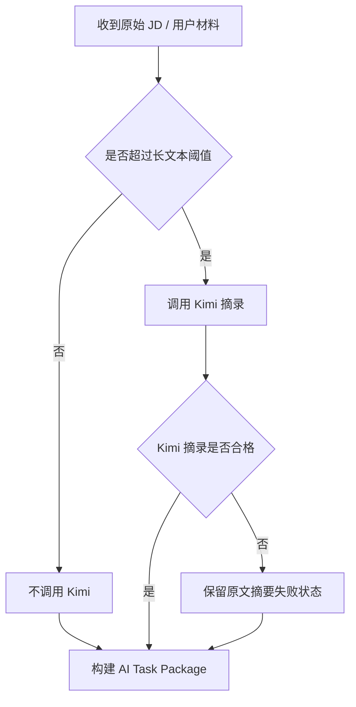
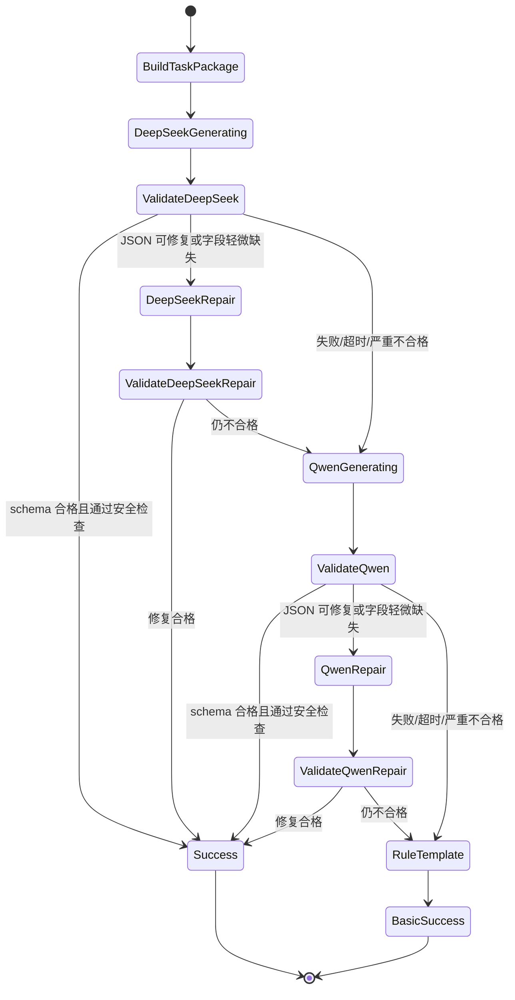
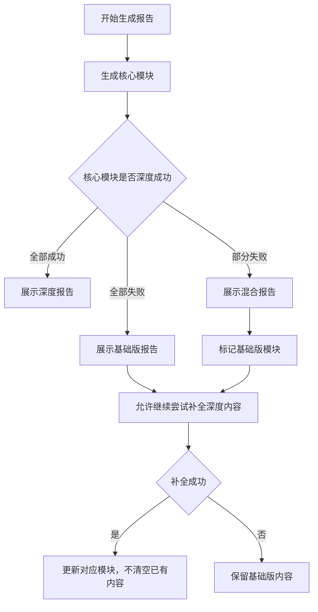

# 求职地图 V0.4 多模型 Fallback 状态机

## 1. 设计目标

V0.4 的模型策略不是“保证某个模型一定成功”，而是保证用户一定能拿到可信结果。

状态机目标：

- DeepSeek 作为主模型。
- Qwen 作为当前模块备用模型。
- Kimi 只做长文本结构化摘录。
- 规则模板作为最终兜底。
- 失败不清空已有结果。
- 基础版报告不是失败页，而是最低可交付版本。

## 2. 模型职责

DeepSeek：

- 全流程主模型。
- 负责主要模块生成。

Qwen：

- 当前模块备用模型。
- DeepSeek 失败、超时、schema 不合格时接手。
- 使用同一份完整 AI Task Package 从头生成当前模块。
- 不续写 DeepSeek 半成品。

Kimi：

- 只做长文本结构化摘录。
- 不做判断、推荐、改写。
- 默认不调用。

规则模板：

- 最终兜底。
- 生成基础版报告或基础版模块内容。

## 3. Kimi 触发状态

触发条件：

- JD 超过约 5000 中文字。
- 用户材料超过约 8000 中文字。
- 任务包预计 token 超过安全阈值。
- DeepSeek 因上下文过长失败一次后。

Kimi 合格标准：

- 有来源片段。
- 有结构化字段。
- 有待核实信息。
- 不包含判断、推荐、改写。

## 4. 单模块生成状态机

## 5. 状态说明

### 5.1 BuildTaskPackage

系统构建完整 AI Task Package。

必须包含：

- 当前模块。
- 用户阶段。
- 诊断模式。
- 已确认经历。
- 用户补充回答。
- 有 JD 模式的岗位要求。
- 输出 schema。
- 安全红线。
- 禁止使用的信息。

### 5.2 DeepSeekGenerating

DeepSeek 生成当前模块。

可能结果：

- 成功。
- 超时。
- API 失败。
- 输出不可解析。
- schema 不合格。
- 安全检查不合格。

### 5.3 DeepSeekRepair

仅在输出接近可用时尝试结构修复。

适用：

- JSON 格式轻微错误。
- 个别字段缺失。
- 文本包裹导致解析失败。

不适用：

- 明显编造。
- 使用未确认经历。
- 模块内容跑偏。
- 输出安全红线内容。

### 5.4 QwenGenerating

Qwen 接手当前模块。

关键规则：

- 使用同一份完整 AI Task Package。
- 从头生成当前模块。
- 不读取 DeepSeek 半成品作为续写内容。
- 输出同样 schema。

### 5.5 QwenRepair

规则同 DeepSeekRepair。

Qwen 修复失败后进入规则模板。

### 5.6 RuleTemplate

规则模板生成基础版内容。

特点：

- 不依赖深度模型。
- 只使用已确认经历和稳定规则。
- 输出偏保守。
- 不编造。

## 6. 报告级状态机

## 7. 用户端状态展示

### 7.1 正在生成

展示：

- 当前步骤。
- 预计等待时间。
- 可理解文案。

示例：

> 正在整理你的经历信息，预计 20-40 秒。

> 正在生成求职行动报告，预计 1-2 分钟。

### 7.2 主模型失败，备用模型接手

用户端不展示模型名称。

展示：

> 当前生成较慢，系统正在换一种稳定方式继续处理，请稍等。

### 7.3 基础版生成

展示：

> 当前已为你生成基础版报告。内容基于你确认过的信息和稳定规则整理，会偏保守，但不会替你编造经历。你可以先参考，系统也会继续尝试补全深度内容。

### 7.4 补全失败

展示：

> 深度内容暂时没有补全成功，基础版报告仍然可以参考。你可以稍后重试。

## 8. 不展示给用户的信息

用户端隐藏：

- token。
- 成本。
- 模型明细。
- provider 错误原文。
- schema 校验细节。

可以展示：

- 当前步骤。
- 预计等待时间。
- 是否已生成基础版。
- 是否可以重试。
- 是否可以继续查看。

## 9. 安全检查

每次模型输出后必须检查：

- 是否使用未确认经历。
- 是否新增事实。
- 是否伪造学历、公司、证书、时间、项目成果。
- 是否把参与写成主导。
- 是否输出保证 offer 或保证进面。
- 是否输出绝对化职业判断。
- 面试模块是否输出虚构完整答案。
- 无 JD 方向是否没有经历证据。
- 有 JD 匹配是否证据错位。

任何一项命中，都视为不合格。

## 10. 基础版最低内容标准

基础版报告至少包含：

- 已确认经历摘要。
- 当前可参考的方向或岗位匹配概览。
- 简历表达提醒。
- 7 天内行动建议。
- 需要补充的信息。
- 真实性边界提示。

基础版不能只显示：

- “生成失败”。
- “请稍后重试”。
- 空报告。
- 与用户经历无关的通用建议。
