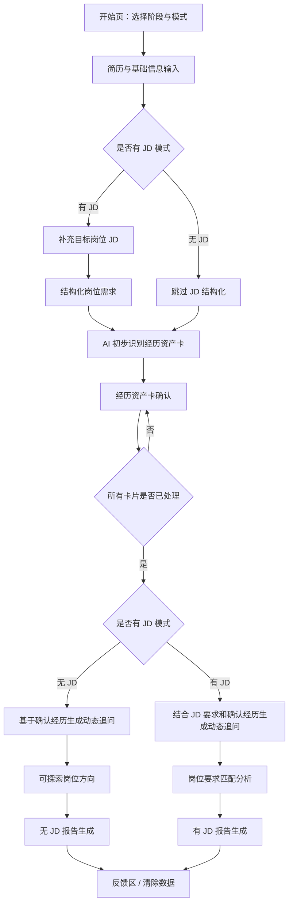

# 求职地图 V0.4 产品流程说明

## 1. 流程目标

V0.4 产品流程要保证两件事：

- 用户能在无 JD 和有 JD 两种模式下完整走完。
- 即使 AI 深度生成失败，用户也能获得基础版报告并继续行动。

流程设计优先级：

1. 真实经历先确认。
2. AI 分析只使用确认后的信息。
3. 失败不阻断。
4. 手机端不降级核心功能。

## 2. 总流程

## 3. 页面 1：开始页

### 3.1 用户任务

用户需要完成：

- 选择当前阶段：准应届生 / 应届生。
- 选择诊断模式：无 JD 经历盘点 / 有 JD 定制诊断。
- 理解隐私提示和真实性边界。

### 3.2 页面内容

必须展示：

- 产品用途：基于真实经历生成求职行动报告。
- 隐私提示：用户可清除本次分析数据。
- 真实性声明：后续建议只基于用户确认过的信息。
- 真实 AI 状态：区分真实 AI、演示结果、失败或基础版。

### 3.3 不做

- 不做营销型 landing page。
- 不使用焦虑化文案。
- 不承诺保证进面或 offer。

### 3.4 进入下一步条件

- 已选择阶段。
- 已选择诊断模式。
- 已确认真实性声明。

## 4. 页面 2：简历与基础信息输入

### 4.1 用户任务

用户输入求职分析所需材料。

### 4.2 字段

基础字段：

- 学历。
- 学校。
- 专业。
- 毕业时间。
- 城市。
- 目标方向。

材料字段：

- 简历文本。
- 经历材料补充。
- 有 JD 模式下的目标岗位 JD。

### 4.3 交互要求

- 简历粘贴框优先。
- 长文本输入框支持多行。
- 输入页不要求用户一次写完所有信息。
- 文件上传若存在，必须说明暂不承诺完整解析能力。

### 4.4 进入下一步条件

- 至少提供一段经历材料或简历文本。
- 有 JD 模式下必须先提供 JD 文本，不能等到匹配分析页再补。

### 4.5 有 JD 模式的前置处理

用户选择有 JD 模式后，JD 是动态追问的前置输入。

处理规则：

- 系统先读取用户补充的目标岗位 JD。
- 将 JD 拆成岗位要求、职责、工具、经验、软素质等结构化要求。
- 后续动态追问必须同时结合结构化岗位要求和用户已确认经历。
- 如果 JD 过长，先按 Kimi 触发规则做结构化摘录。
- JD 结构化结果只能来自用户提供的 JD 或 Kimi 来源片段，不得凭空补岗位要求。

## 5. 页面 3：经历资产卡确认

### 5.1 用户任务

用户核对 AI 初步整理出的经历卡，确认哪些可以进入后续分析。

### 5.2 卡片类型

- 教育。
- 实习。
- 项目。
- 校园。
- 兼职。
- 荣誉。
- 技能作品。
- 缺口 / 补强卡。

### 5.3 卡片状态

- 待确认：AI 初步识别，用户未处理。
- 确认使用：用户确认内容真实，可进入分析。
- 编辑后确认：用户修改后确认，可进入分析。
- 暂不使用：不进入分析。

### 5.4 关键规则

- 所有卡片必须被处理。
- 未确认卡存在时，不允许进入下一步。
- 点击下一步时，要提示并定位到第一张未确认卡。
- 后续模块只能读取确认使用 / 编辑后确认的经历。

### 5.5 页面提示文案

> 请先核对你的经历卡。AI 已完成初步整理，但可能存在识别错误、遗漏或分类不准。请你确认、修改或删除不准确的内容。后续诊断会以你确认后的信息为准。这一步不是考试，只是为了让后面的分析更贴近你的真实情况。

## 6. 页面 4：动态追问

### 6.1 用户任务

用户根据系统追问补充真实细节。

### 6.2 追问生成依据

必须结合：

- 已确认经历。
- 用户已有补充回答。
- 用户阶段。
- 目标方向。
- 有 JD 模式下的岗位要求。

有 JD 模式下，动态追问必须发生在用户补充 JD 且经历卡确认之后。系统要先知道岗位需要什么，再用内部追问方法判断用户经历里是否有对应证据。

### 6.3 追问方法

系统内部可以从以下角度生成追问：

- HR 视角：面试官可能关心什么、会追问哪里。
- TAR：任务、行动、结果。
- PART：问题、行动、结果、复盘。
- PREP：观点、理由、例子、回到能力点。

这些方法同样适用于无 JD 和有 JD 两种模式。

无 JD 模式下，系统围绕用户确认经历、目标方向和可迁移能力生成追问。

有 JD 模式下，系统必须围绕岗位要求使用这些方法。例如先识别某条 JD 要求，再找到可能相关的已确认经历，然后从 HR 角度或 TAR/PART/PREP 维度生成问题，帮助用户回忆真实证据。

这些方法只作为系统内部逻辑，不在用户界面展示。用户不应看到“HR 视角”“TAR”“PART”“PREP”“为什么问”“事实回忆维度”等标签或推理链，只看到自然、具体、可回答的问题。

### 6.4 交互要求

- 每轮 1-3 个问题。
- 问题具体、短、易回答。
- 支持保存、跳过、稍后补充、快速完成。
- 不展示追问方法名。
- 不展示内部推理链。
- 不展示“可能挖出的亮点”。
- 不给完整示例答案。
- 不暗示用户补造数据。

### 6.5 输出沉淀

用户回答后，系统可沉淀为：

- 补充事实。
- 待核实信息。
- 可用于简历表达的真实细节。
- 面试回答素材边界。

## 7. 页面 5A：无 JD 可探索岗位方向

### 7.1 用户任务

用户查看可探索方向，并选择下一步验证动作。

### 7.2 模块结构

每个方向包含：

- 方向名称。
- 可搜索岗位名称 3-5 个。
- 为什么可以探索。
- 对应经历证据。
- 当前缺口。
- 探索优先级。
- 7 天验证动作。

### 7.3 关键规则

- 每个方向必须绑定至少一段已确认经历。
- 不允许证据错位。
- 不使用绝对化判断。
- 不输出无法搜索的抽象岗位。

## 8. 页面 5B：有 JD 岗位要求匹配分析

### 8.1 用户任务

用户查看目标 JD 与当前材料的对应关系。

### 8.2 模块结构

每条岗位要求包含：

- 岗位要求。
- 匹配程度。
- 已确认经历证据。
- 当前缺口。
- 简历表达建议。
- 面试风险。

### 8.3 匹配程度

- 匹配较强。
- 有一定匹配。
- 需要补充证据。
- 当前证据不足。

### 8.4 投递判断

- 建议优先投递。
- 可以投递，建议先优化简历。
- 可以作为尝试方向。
- 建议先补强后再重点投递。

### 8.5 关键规则

- 每条岗位要求必须绑定已确认经历，或标注当前证据不足。
- 匹配程度不是能力评价。
- 手机端使用卡片，不使用横向表格。

## 9. 页面 6：报告页

### 9.1 无 JD 报告模块

必须包含：

- 已确认经历资产摘要。
- 可探索岗位方向。
- 简历改写建议。
- 下一步行动计划。
- 需要补充的信息。
- 真实性边界提示。

不包含：

- 面试可讲故事模块。
- 绝对化职业判断。

### 9.2 有 JD 报告模块

必须包含：

- 岗位要求匹配分析。
- 简历改写建议。
- 面试追问与回答准备。
- 下一步行动计划。
- 需要补充的信息。
- 真实性边界提示。

### 9.3 基础版报告

AI 深度生成失败时，展示基础版报告。

基础版报告必须包含：

- 已确认经历摘要。
- 保守的方向或匹配概览。
- 简历表达提醒。
- 7 天内行动建议。
- 待补充信息。

页面提示：

> 当前已为你生成基础版报告。内容基于你确认过的信息和稳定规则整理，会偏保守，但不会替你编造经历。你可以先参考，系统也会继续尝试补全深度内容。

## 10. 页面 7：反馈区

### 10.1 用户任务

用户反馈报告是否有用。

### 10.2 字段

- 报告是否有帮助。
- 最有用的部分。
- 最不准的部分。
- 是否愿意继续使用。
- 是否匿名授权用于产品优化。

### 10.3 规则

- 不默认公开案例。
- 不默认用于训练。
- 支持清除本次分析数据。

## 11. 移动端流程要求

- 所有页面单栏优先。
- 表格转卡片。
- 长文本自动换行。
- 底部固定按钮不得遮挡正文。
- 所有核心动作可触控完成。
- 报告模块可展开、可复制、可继续。

## 12. 关键异常流程

### 12.1 经历卡未确认

触发条件：

- 用户点击下一步，但存在待确认卡。

处理：

- 阻止进入下一步。
- 展示提示。
- 定位到第一张待确认卡。

### 12.2 AI 深度生成失败

触发条件：

- DeepSeek 和 Qwen 均失败。
- 输出 schema 不合格且重试失败。

处理：

- 展示基础版报告。
- 允许用户继续查看。
- 允许稍后重试深度补全。

### 12.3 长文本超过阈值

触发条件：

- JD 超过约 5000 中文字。
- 用户材料超过约 8000 中文字。
- 任务包预计 token 超过安全阈值。

处理：

- 触发 Kimi 结构化摘录。
- 摘录结果只作为结构化输入。
- 不让 Kimi 做判断、推荐、改写。
